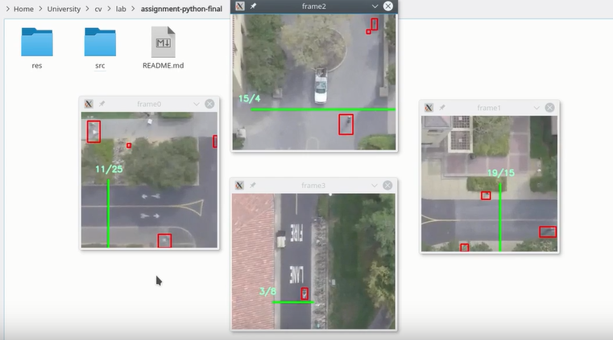

# Assignment Computer Vision



## Task Description
The objective of the assignment is to count the number of pedestrians and cyclists entering and exiting the main four gates in the video (top, bottom, left, right).

The input video belongs to the [Stanford Drone Dataset - Gates](http://cvgl.stanford.edu/projects/uav_data/).

## Requirements
- Python (tested with python 3.5.2)
- OpenCV (tested with 3.3.1)
- numpy

## How to run

```
python3 src/main.py <video-path>
```

If no video path is specified, it will use "res/video.mov" as default argument.

## Brief overview
For each frame of the video, the script performs a background subtraction, using the implementation [MOG2](https://docs.opencv.org/3.1.0/d7/d7b/classcv_1_1BackgroundSubtractorMOG2.html), in order to recognize the object
moving in the foreground of the video. This tecnique give me best results compared to the adaptive background subtraction or using just frame differencing, MOG2 is also able to remove some noise after some iterations.

### Detect objects
There exists a MOG2 instance for each gate with different threshold parameters. After applying the background differencing technique, the method *detectObjects* applies different operations such as *closing* and then *dilation*
to highlight the objects and merge differents parts belonging to the same object, such as the object and its shadow.

### Blobs and home-made tracking
The list of blobs that we are currently tracking is kept updated by the function *addNewBlob*. For each newly detected blob, it checks if there is an overlap with the predicted position of some existing blobs. If the new blob overlaps with some blob that we are already tracking, it will be added to the history of the matching blob. If there is no match,the detected shape will be added to the list as a new *Blob* object. The function *removeOldBlobs* removes no longer up to date (no-matching blob as been seen for more than K frames) *blob* from the list *blobs*.

### GoalLine
When the upper-left corner of the bounding box of an updated *Blob* crosses the GoalLine and has a history greater than K frames (to distinguish it from noise), the counter of "exiting blobs" or "entering blobs" will be increment. The direction (entering/exiting) of the Blob is determinated by its history.

### Problems and previous attempts
The described technique has some limitations. For example, it is impossibile, by using frame differencing and blob detection, to recognize if a unique shape belongs to one object or of a group of near objects. Other than that, it is necessary to tune the parameters for threshold, closing, dilation etc to deal with noise and adjust the true/false positives ratio.

The submitted implementation is the results of tons of tests: changing both parameters and techniques. Among the techniques that have been tried without any remarkable result: 
[KCF](https://docs.opencv.org/3.2.0/d2/dff/classcv_1_1TrackerKCF.html), [dlib tracking](http://dlib.net/correlation_tracker.py.html), [meanshift](https://docs.opencv.org/trunk/db/df8/tutorial_py_meanshift.html), [kalman filter](https://docs.opencv.org/trunk/dd/d6a/classcv_1_1KalmanFilter.html).

## Results

Scores (entering, exiting):

Left (112, 169)  
Right (116, 147)  
Top (117, 108)  
Bottom (120, 84)

Video is available here: https://drive.google.com/file/d/1KrFyDpMvR4zEVk7fsSoeEIQbpbOhkO8-/view?usp=sharing